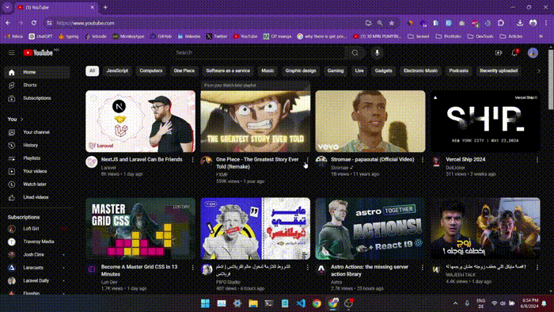

# Count List: *YouTube Playlist Duration Estimator*

This Chrome extension shows the total, watched, and remaining time of a YouTube playlist directly on the YouTube page. It also provides estimated durations if the video playback speed is increased to 1.25x, 1.5x, 1.75x, or 2x. The information is displayed both on the YouTube page and in the extension popup.




## Features

- Displays total, watched, and remaining time of a YouTube playlist.
- Provides estimated durations for playback speeds of 1.25x, 1.5x, 1.75x, and 2x.
- Shows information directly on the YouTube page and in the extension popup.
- Automatically updates when a new playlist is opened.
- Detects if no playlist is open and shows an appropriate message.

## Installation

1. **Clone the Repository:**
   ```sh
   git clone https://github.com/yourusername/YouTube-Playlist-Duration-Estimator.git
   cd YouTube-Playlist-Duration-Estimator
2. **Load the Extension in Chrome**:
    - Open Chrome and go to **chrome://extensions/**.
    - Enable *"Developer mode"* using the toggle switch in the top right corner.
    - Click "Load unpacked" and select the folder where you cloned the repository.
## Usage
- Navigate to YouTube and open any playlist.
- The total, watched, and remaining durations will be displayed at the top of the playlist panel.
- Click the extension icon in the Chrome toolbar to open the popup and view the estimated durations for different playback speeds.

## Files
- **manifest.json:** The manifest file that defines the extension's configuration.
- **content.js:** The content script that calculates and displays the playlist durations on the YouTube page.
- **popup.html:** The HTML file for the extension popup.
- **popup.js:** The JavaScript file for the extension popup logic.
- **background.js:** The background script (currently not used, but available for future features).
- **style.css & popup.css:** css styles.
- **icons**: images *folder*.

##### Thanks to the  Chat-GPT for assisting in the creation of this extension.

# Contact
If you have any questions or suggestions, feel free to open an issue or contact me at [contact.gald@gmail.com](contact.gald@gmail.com).